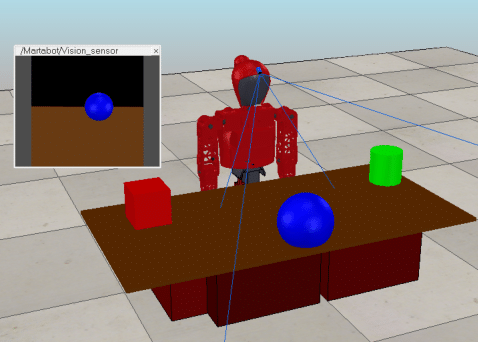
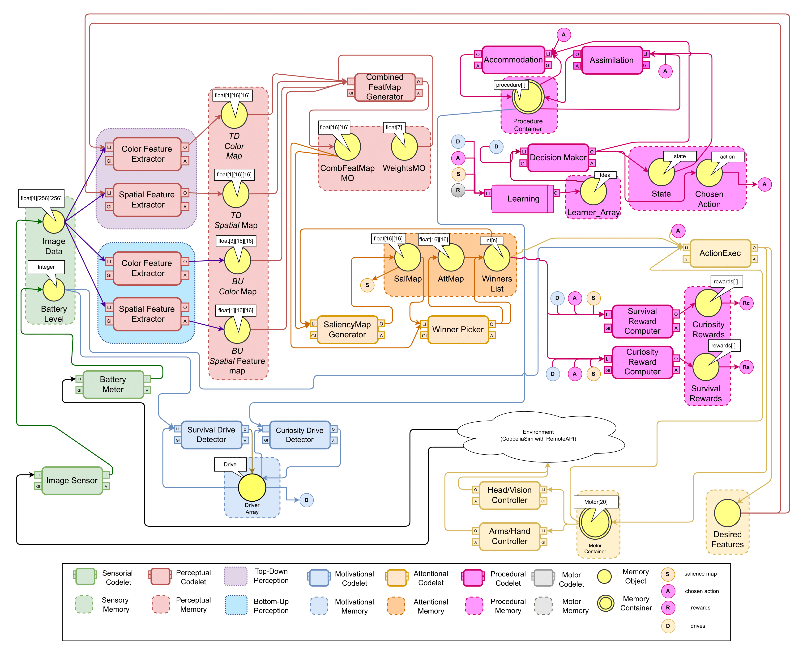
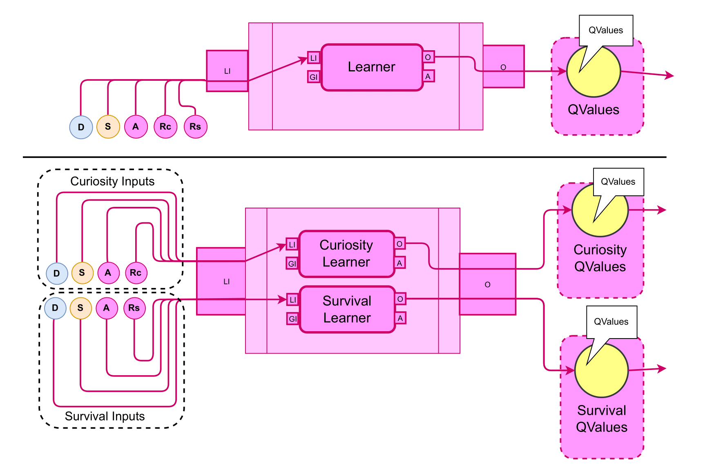

# Dual or Unified: Optimizing Drive-Based Reinforcement Learning for Cognitive Autonomous Robots

This repository contains the codebase accompanying the research article titled **"Dual or Unified: Optimizing Drive-Based Reinforcement Learning for Cognitive Autonomous Robots"**, submitted to *Cognitive Systems Research*. The work evaluates different reinforcement learning strategies inspired by cognitive architectures, applied to autonomous humanoid agents motivated by curiosity and survival drives.

## 📄 Overview

The study compares two distinct learning strategies implemented in humanoid robots:

- **1-LDO (Unified Learning for Drives Optimization):** A single Q-Table/DQN is used to optimize both survival and curiosity drives.
- **2-LDO (Dual Learning for Drives Optimization):** Separate Q-Tables/DQNs are used for each drive, updating only the one most activated at each step.

These strategies are embedded in a cognitive architecture (CONAIM) and evaluated under varying levels of environmental granularity.

## 🤖 Agent and Environment

Experiments were conducted using a simulated humanoid robot named **Marta**, developed in **CoppeliaSim (V-REP)**. Marta:

- Is 1.1m tall with 25 degrees of freedom
- Uses RGB-D sensors
- Has a virtual actuator "Fovea" simulating eye saccades
- Interacts with objects (red cube, green cylinder, blue sphere) on a tabletop environment

<p align="center">
  
<br/>
  <em>Fig: The humanoid robot Marta is shown in the simulation environment,
seated in front of a table with three distinct objects: a blue ball, a red cube, and a green
cylinder. </em>
</p>

## 🧠 Cognitive Architecture: CONAIM

- Based on **Conscious Attention-based Integrated Model (CONAIM)**;
- Implemented with CST - **Cognitive System Toolkit**;

<p align="center">
  
<br/>
  <em>Fig: Cognitive Architecture Implementation. The cognitive cycle follows these steps:
(i) Sensory data acquisition, including battery levels and visual input; 
(ii) Perceptual processing via bottom-up and top-down functions, which create a combined feature map for the attentional system to determine the agent’s focus. The top-down features also impact the motivational system and procedural learning; 
(iii) The motivational system assigns values to each drive, feeding into a dynamic subsumption architecture. Drives are used to define the agent’s rewards and states. In the case of the system with 2 Q-Tables or 2 DQNs, the type of the drive is used to select the learning memory object; 
(iv) The attentional system multiplies the combined feature map with the attentional map to produce a saliency map, which is part of the agent’s state; 
(v) The learning module generates rewards and Q-Table(s) / DQNs and use the active learning table to select the optimal action based on the agent’s current state to be executed; 
(vi) Finally, motor commands are sent to the actuators to perform actions in the environment, completing the cognitive cycle. 

In order to simplify the diagram, 4 shortcuts were inserted, representing some memory objects: S– Saliency Map, A– Choosen Actions, R– Rewards, Rc– Curiosity Rewards, Rs– Survival Rewards and D– Drives. 

The component “Learning” is composed of different elements depending on the configuration used and also have different inputs and outputs, as illustrated below.</em>
</p>

<p align="center">
  
<br/>
  <em>Fig: Illustration of the two ways of the implementation of the component “Learning”. It changes how the motivational system influences learning and the inputs used for each learner: 
  
(Above – 1-LDO) The inputs are always the same. Both drives affect the same Q-Table or DQN, with the most motivated drive generating rewards and updating the agent’s state. 

(Below – 2-LDO) The inputs change according to the motivation type. Each drive affects a separate learner, where only the most active drive updates its specific Q-Values, while the other remains unchanged. This figure is represented in the main diagram only as a module called “Learning”. </em>
</p>

### Components

- Bottom-up and top-down attention
- Drive-based motivational system (curiosity and survival)
- Procedural memory and learning
- Reinforcement learning modules (Q-Learning, DQN)
- Integration with environmental stimuli via sensory processing and motor codelets

Motivation and attention are dynamically adjusted based on sensory data, and procedural learning mimics assimilation and accommodation inspired by Piaget’s theory.

## ⚙️ Learning Configurations

Two configurations are supported:

### 1-LDO (Unified)
- A single learner for both drives
- Rewards and states are updated based on both drives at each step

### 2-LDO (Dual)
- Independent learners per drive
- Only the most active drive updates its Q-values at each step

## 🧪 Experiments

Two experimental setups were explored:

| Setup | Battery Step | Drive Step |
|-------|---------------|------------|
| I     | 10 units      | 0.2        |
| II    | 5 units       | 0.1        |

- **300 training episodes**, each with up to 500 steps
- **50 test episodes**, stress measured via drive satisfaction
- DQN networks employ RBF-activated deep neural nets

## 📊 Key Results

- **DQN agents outperform Q-Learning** in fine-grained environments, especially under the **2-LDO** configuration, due to better adaptability and learning stability.
- **1-LDO with Q-Learning** performs more efficiently in coarser environments (larger step sizes), offering faster drive regulation with lower computational cost.
- **2-LDO provides superior long-term balance and robustness**, particularly when combined with deep learning in complex scenarios.
- Performance differences across agent types, configurations, and environments were statistically validated using repeated-measures ANOVA.


## Citation

<!--Don't remove the following tags, it's used for placing the generated citation from the CFF file-->
<!--CITATION START-->
```bibtext
@software{Rossi-LL-RL-CSR,
author = {de Lellis Rossi, Leonardo and Luna Colombini, Esther  and Ribeiro Gudwin, Ricardo and Paro Costa, Paula and Mara Berto, Letícia and Simões, Alexandre},
doi = {10.5281/zenodo.14424260},
title = {rl_CSR},
url = {https://github.com/leolellisr/rl_CSR}
}
```
<!--CITATION END-->

## Authors
  
- (2025-) Leonardo de Lellis Rossi: PhD Candidate, FEEC-UNICAMP
- (Supervisor, 2025-) Ricardo Gudwin: Professor, FEEC-UNICAMP
- (Co-Supervisor, 2025-) Esther Luna Colombini: Professor, IC-UNICAMP
  
## Acknowledgements

- LR is funded by MCTI project DOU 01245.003479/2024 -10. 
- RG is funded by CEPID/BRAINN (FAPESP 2013/07559-3) grant.
- EC is partially funded by CNPq PQ-2 grant (315468/2021-1)

This project was supported by the brazilian Ministry of Science, Technology and Innovations, with resources from Law № 8,248, of October 23, 1991, within the scope of PPI-SOFTEX, coordinated by Softex and published Arquitetura Cognitiva (Phase 3), DOU 01245.003479/2024 -10.


## License

 GNU LESSER GENERAL PUBLIC LICENSE - Version 2.1, February 1999
